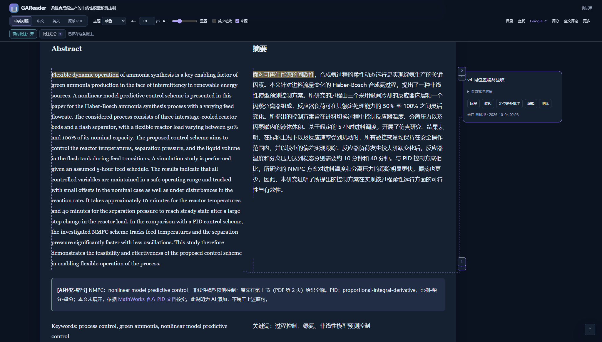
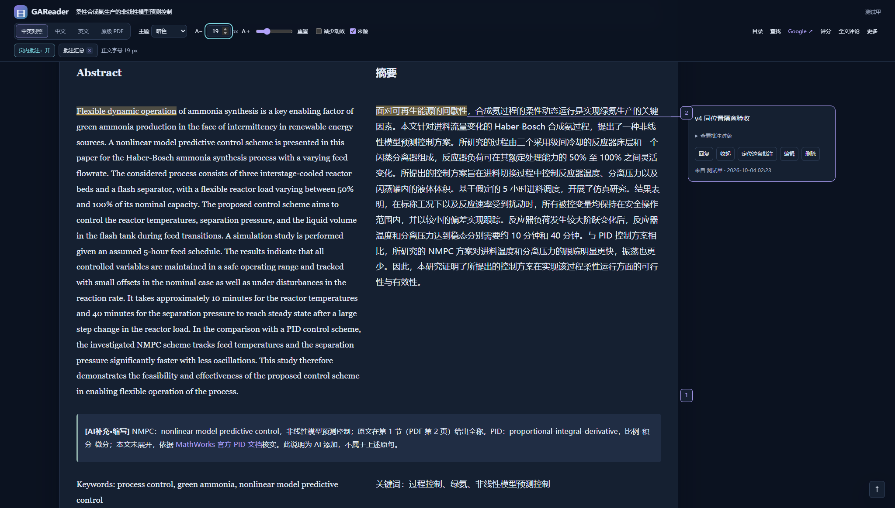

# v4 定点修复：实际应用验收与维护

日期：2026-10-04。基线 `b2249219fc6d7fa579763eebd35fffd84c9298c3`，功能提交 `5968a935396f213ff4e8125239d05d183298a924`。只修批注显示计划、PDF 入口和标签默认可用性，以及直接相关的搜索／键盘回归。没有重翻译、改写原论文、重写框架或修改已应用的 0003。

## 运行对象与数据保护

实际源码目录是 ChatGPT 项目本地工作目录下的 `GAReader/`；正式持久数据继续使用同级 `paper_library_codex_local_v3/var/`，没有换成新库。正式站监听 `127.0.0.1:8047`。维护前核对监听进程、虚拟环境父进程、启动参数、数据目录、迁移状态和静态文件；原先的 geometry 脚本与 b224921 一致。数据路径中的本机用户名不进入公开记录。

先停机备份，再在隔离副本验收。正式恢复前，20 张表逐行一致、90 个论文文件字节一致，包括原有 2 个账户、2 篇论文、1 条批注及其原始锚点；见 [只读比对](root-cause-v4/formal-preservation.json)。恢复后核对登录页 200、原实例和 7 个脚本的实际响应字节，见 [运行构建](root-cause-v4/running-build.json)。正式库仍为 13 个停用标签、零自动贴标，未代建管理员。已有本机启动入口继续指向原数据目录；停止脚本已兼容 Windows 虚拟环境启动器及其实际监听子进程。

公开证据经过筛选，不含 Cookie、令牌、密码、真实用户名、数据库、备份、浏览器配置或会话文件。实际测试使用 Microsoft Edge 154.0.4258.53、项目 Playwright，以及两篇真实示例；不以指令包的静态重现页代替应用。

## 修复机制

- 后端给每个投影附带 `source_segment_index`。前端 `annotation-display.js` 为每个原始来源片段选择可见目标，精确原选区优先于另一语言的段落备用映射。保留真正的多段、多页覆盖，投影顺序不影响结果，数据库 source 保持不变。
- 高亮、点击命中、标记、卡片、短连线和定位共用计划，矩形携带线程、片段及精度。侧栏改变宽度后重新完成分栏与测量。左栏到右侧卡片没有安全短路径时使用高亮／标记，不画绕整段的 U 形线。计数统计线程；混合精度的卡片逐片段说明。
- 卡片点击与键盘聚焦联动原选区；卡片更换宿主时保持键盘焦点。回复按钮不引发二次跳转。Ctrl+Enter 发布，Enter 换行，输入法合成不提交。修正搜索回车的默认行为，避免面板关闭后重新弹出。
- “原版 PDF”和“在阅读器中查看原版”进入同一修订的站内 PDF.js；只有“下载原文 PDF”走附件。读取失败提供原因和重试，保留鉴权、文件指纹、CSP 与 HTML 附件沙箱。
- 全新 setup 启用 13 个常用标签；重复 setup 不改管理员启停决定。旧库空态链接到既有 TagAdmin.enable。阅读页显示标签，提交者／管理员可补充；历史停用词默认保留，勾选才移除。

## 同位置复验

柔性合成氨，中文摘要“面对可再生能源的间歇性”，中英对照、19 px、暗色，2048 × 1165。基线出现英文整段备用投影、重复位置标记和错误连线；修复后该中文片段只有一个 exact 主目标，连线起点 `(1069, 268.09)` 与实际中文选区完全一致，线为实线，包含该线程的标记只有一处。

| 修改前 b224921 | 修改后 5968a93 |
|---|---|
|  |  |

截图中英文短语的独立高亮来自另一条既有 PDF 线程，因此合并标记显示 2；它不是同一中文线程的备用英文整段。判断是否重复采用线程 ID 与显示目标断言，不能仅看数字。

## 验收对照

| 项目 | 结果与实际覆盖 | 证据 |
|---|---|---|
| A01 | PASS，同位置中文精确选区、实线、单位置标记、汇总关闭 | [主浏览器](root-cause-v4/browser-results.json) |
| A02 | PASS，英文单语使用段落对应，回双语恢复中文 exact | 主浏览器 |
| A03 | PASS，英文划词反向验证，无安全线路时不画 U 形线 | 主浏览器；[跨语言截图](root-cause-v4/english-to-chinese-fallback.png) |
| A04 | PASS，实际 API 返回投影反序后目标、精度、标记和线端点不变 | 主浏览器 |
| A05 | PASS，同段多线程、真实多行选区、同线程两个来源片段、PDF exact＋block、原有跨页文字锚点 | [补充浏览器](root-cause-v4/regression-results.json)；[混合定位](root-cause-v4/mixed-exact-block-pdf.png)；[跨页](root-cause-v4/cross-page-pdf-segment.png) |
| A06 | PASS，卡片／高亮／键盘、回复不滚动、编辑保持原选区、IME guard、Ctrl+Enter | 主浏览器、补充浏览器 |
| A07 | PASS，3 视口 × 4 字号 × 3 视图 × 2 开关＝72 组；原生 200% 再做 24 组 | 主浏览器；[原生缩放](root-cause-v4/native-zoom-results.json)；[200% 19px](root-cause-v4/reader-native-200-font19.png)；[390px](root-cause-v4/reader-390-19.png) |
| A08 | PASS，100 处搜索高亮独立保留；关闭页内批注仍可临时回源并返回原视图／修订／位置；真实 25 秒轮询保留焦点和未发布草稿 | 补充浏览器 |
| B01 | PASS，两篇顶部按钮均为 0 次下载，真实 canvas、文字层、页码加载 | 主浏览器 |
| B02 | PASS，信息菜单关闭并进入同一修订 PDF，0 次下载 | 主浏览器 |
| B03 | PASS，明确下载每篇各 1 次，字节 SHA-256 与修订一致 | 主浏览器 |
| B04 | PASS，点击元素、URL、状态、Content-Type、Content-Disposition、下载事件和页面错误均记录 | 主浏览器的 clicks／network／downloads／errors |
| B05 | PASS，无 PDF、当前文件缺失、真实旧修订 PDF 缺失、指纹不匹配、登录失效；恢复附件／登录后按钮重试成功，0 次下载；HTML 仍为 attachment＋sandbox | [异常恢复](root-cause-v4/pdf-errors-results.json) |
| C01 | PASS，从空目录正常 setup，创建测试账号前已断言 13 项启用 | [安装输出](root-cause-v4/maintenance-output.txt)；[标签浏览器](root-cause-v4/tags-browser-results.json) |
| C02 | PASS，旧 0003 库初始 0 项启用，后台只选 NMPC／IDAES 启用，另一个人工停用词保持停用；重复 setup／重启不重置 | 标签浏览器；[持久化](root-cause-v4/tag-persistence.json) |
| C03 | PASS，实际发布分别为 1／5 项，0／6／伪造 ID／停用词拒绝；预览后停用词会阻止发布 | 标签浏览器、重启浏览器、后端回归 |
| C04 | PASS，分类＋标签→预览→改标签→发布→刷新→实际重启；首页与阅读页显示一致 | [重启浏览器](root-cause-v4/restart-browser-results.json) |
| C05 | PASS，已有 IDAES 的完整定位清单、修订、PDF 指纹、31 条可见批注及源锚点、两项评分 API 均与元信息保存前相同 | 补充浏览器 |
| C06 | PASS，4 启用＋1 停用及仅有 1 停用两种情况，标题修改保留；明确移除有效；其他用户 GET／POST 都被拒绝 | 标签浏览器 |
| D | PASS，同论文／位置／字号／窗口的前后证据、构建、运行和请求记录 | 本文及 [基线证据](root-cause-v4/before-results.json) |

后端 **67 项 PASS**、无缺失迁移，见 [输出](root-cause-v4/backend-results.txt)。离线 DOM **6 组 PASS**，见 [DOM 结果](root-cause-v4/reader-dom-results.json)；显示计划纯函数 **6 组 PASS**，见 [计划结果](root-cause-v4/display-plan-tests.json)。两类模拟测试与真实浏览器证据分别记录。

基线下两篇论文的顶部 PDF 按钮就已经返回 `200 application/pdf; inline` 且没有下载事件；没有声称复现“顶部按钮自动下载”。本轮明确了信息菜单的阅读／下载／外部出处语义，并真实验证两种阅读入口和下载入口。异常用例分别得到 404、409、401 的明确提示，恢复后重新得到 200 inline。

## 安装、升级与回退

新装仍为 `setup.cmd` → `start.cmd`。默认端口 8000，首次 setup 导入两篇示例及可选词表。已有用户必须继续指定原数据目录；先停机备份，再 setup 收集新静态资源，最后 start。不要误用另一源码目录里的默认 var。

```text
backup.cmd --data-dir "D:\GAReaderData"
setup.cmd --data-dir "D:\GAReaderData"
start.cmd --data-dir "D:\GAReaderData" --port 8047
```

本轮没有新增迁移；已有 0003 保持原字节。旧库无可选标签时，管理员在上传页点击“核对并启用标签”，仅选择确认需要的词，执行“启用所选标签（管理员已核对）”。普通读者看到联系管理员提示。若尚无管理员，停机后使用 `manage-account.cmd --data-dir "D:\GAReaderData"` 自行创建，再重新启动。

回退前先备份回退时的当前数据；在另一源码目录准备 b224921，用恢复工具将维护前备份恢复到**全新目录**后指向它启动。不要 reset/clean 现有工作区、覆盖原库或手工倒退迁移。回退副本不会自动合并升级后新记录。正式站切回旧代码为 **NOT_RUN**，本轮保留新版；独立恢复、文件故障恢复和重复初始化均已执行。

完整命令、隔离数据前提与回放顺序见 [tools/TESTING.md](../tools/TESTING.md)。50 人压力测试、局域网／HTTPS／防火墙／系统服务为 **NOT_RUN**，没有在本轮配置。不同浏览器的通用兼容性未宣称完成。历史 v3 验收仍只代表其对应版本，不能拿旧 PASS 替代本轮记录。
